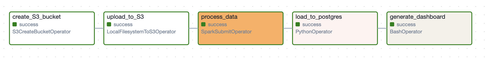
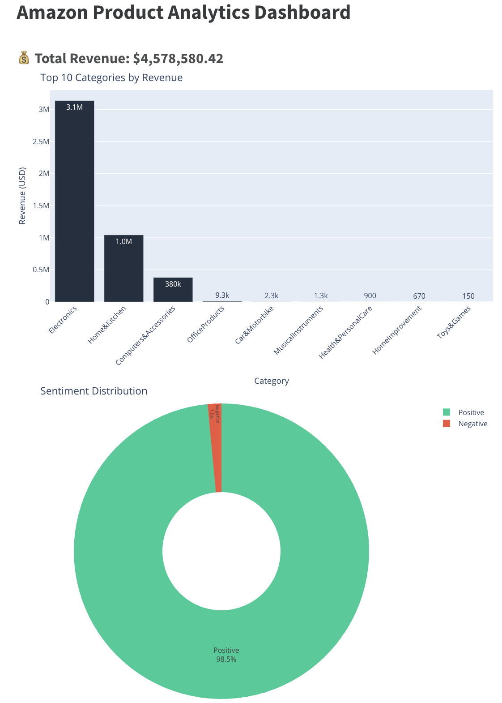

# Amazon Product Analytics Pipeline 🛒📊

> **End-to-End Data Engineering Project**: Build a pipeline to process Amazon sales data from raw (Raw CSV) to an analytical Dashboard, using Docker, Airflow, Spark, and Postgres.

[](https://airflow.apache.org/)
[](https://spark.apache.org/)
[](https://www.docker.com/)
[](https://www.postgresql.org/)

---

## 1. Overview
This project builds an automated Data Pipeline to analyze sales data and customer reviews on Amazon. The system processes raw data (multiple lines, error format), cleans, classifies customer sentiment (Sentiment Analysis), and displays visual reports.

**Objects:**
* Big Data Processing with Spark.
* Orchestration with Airflow.
* Build a standard Data Warehouse (Raw -> Clean -> Serving).

## 2. Architecture



Data Flow:
1.  **Ingestion:** Upload CSV data to **MinIO** (Data Lake - Raw Layer).
2.  **Processing:** **Apache Spark** reads data, processes price columns (`₹`, `%`), cleans review text and classifies sentiment(Positive/Negative).
3.  **Storage:** Save clean data to MinIO (Parquet) and load to **Postgres** (Data Warehouse).
4.  **Visualization:** **Quarto** queries data from Postgres and creates an HTML Dashboard.

## 3. Tech Stack

* **Containerization:** Docker, Docker Compose (Multi-container management).
* **Orchestration:** Apache Airflow (2.9.2) (Scheduling and dependency management).
* **Processing:** Apache Spark (PySpark 3.5) (run local cluster mode).
* **Storage:** MinIO (S3 Compatible), PostgreSQL (Data Warehouse).
* **Visualization:** Quarto, Plotly.
* **Language:** Python, SQL, Bash.

## 4. Key Challenges

Here are some real technical problems I encountered and solved:

* **Multi-arch Support:** Customizing Dockerfile to make Spark and Java run stably on **Apple Silicon (ARM64)** và Intel (AMD64) chips.
* **Handing Dirty Data:**
    * Handling Multiline CSVs that cause Spark to misread.
    * Cleaning up price columns containing strange characters (Currency symbols) using Regex.
    * Handling inconsistent Schema (Schema Evolution) between data files.
* **Optimization:** Using the **Parquet** format to optimize storage and read/write speed compared to CSV.

## 5. How to Run

### Prerequisites
* **Docker Desktop** installed.
* **RAM Configuration:** Ensure Docker is allocated at least **4GB RAM** (Recommended: 6GB+) to run Spark and Airflow smoothly.

### Step-by-Step Guide

**1. Clone the Repository**
```bash
git clone [https://github.com/trhndan21/amazon-ecommerce-pipeline.git](https://github.com/trhndan21/amazon-ecommerce-pipeline.git)
cd amazon-ecommerce-pipeline
```

**2. Start the Infrastructure Build images and start containers using the Makefile shortcut**
```bash
make up
```

**3. Access the Interfaces Once all containers are healthy (check with docker ps), you can access**
* **Airflow UI:** http://localhost:8080
    * User: airflow
    * Password: airflow
* **MinIO Console (S3):** http://localhost:9001
    * User: minio
    * Password: minio123

**4. Trigger the Pipeline**
1. Go to the Airflow UI.
2. Locate the DAG named amazon_analytics_dag.
3. Toggle the ON switch to unpause it.
4. Click the Play button (Trigger DAG) to start the pipeline manually.

**5. Check the Results**
* **Data Quality:** Check MinIO bucket "amazon-bucket" to see the processed Parquet files in clean/amazon_sales/.

* **Data Warehouse:** (Optional) Connect to Postgres to query the amazon.amazon_sales table.

* **Visual Report:** Once the DAG finishes, the dashboard will be generated locally at: dags/scripts/dashboard/dashboard.html (Open this file in your web browser to view the analytics)

**6. Project Results**
* **Airflow Orchestration:**
The pipeline successfully executes extraction, processing (Spark), loading (Postgres), and visualization tasks.


* **Final Dashboard:**
The generated report provides insights into Top Revenue Categories and Customer Sentiment analysis.




